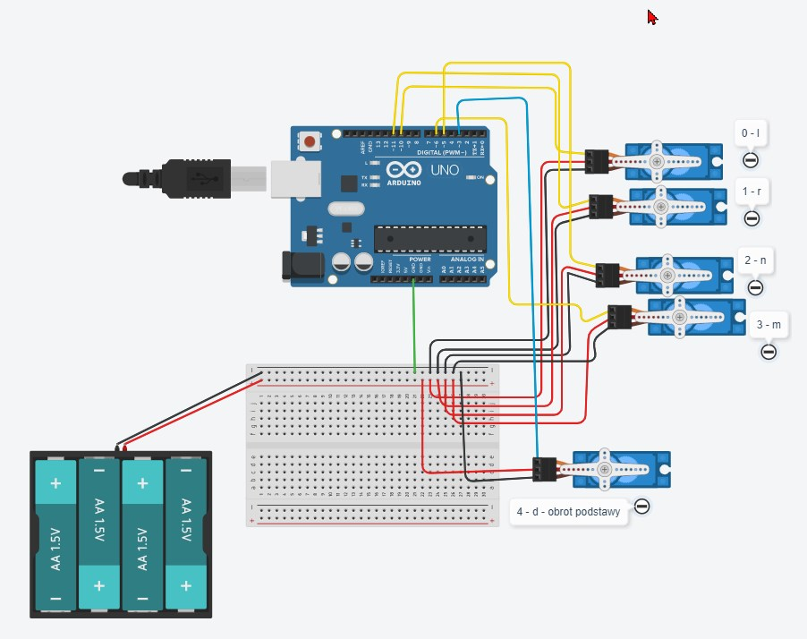
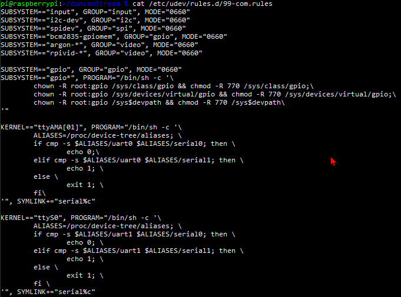
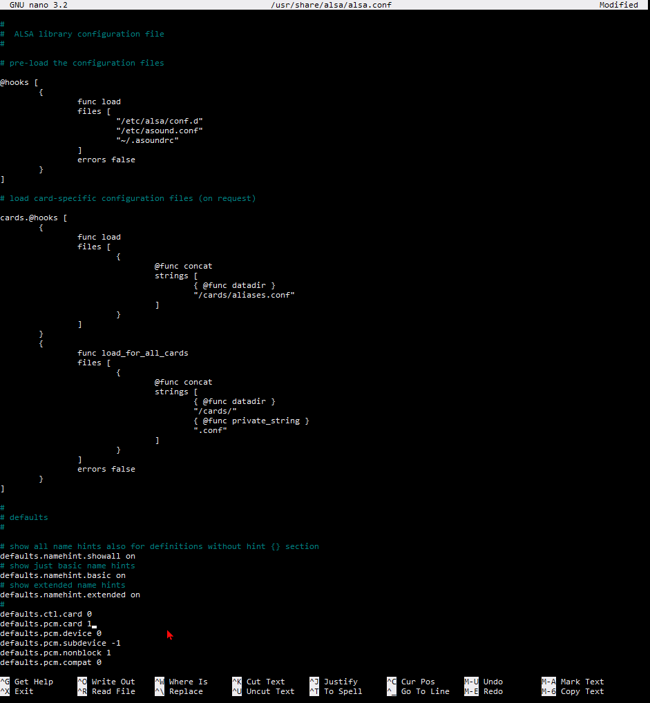
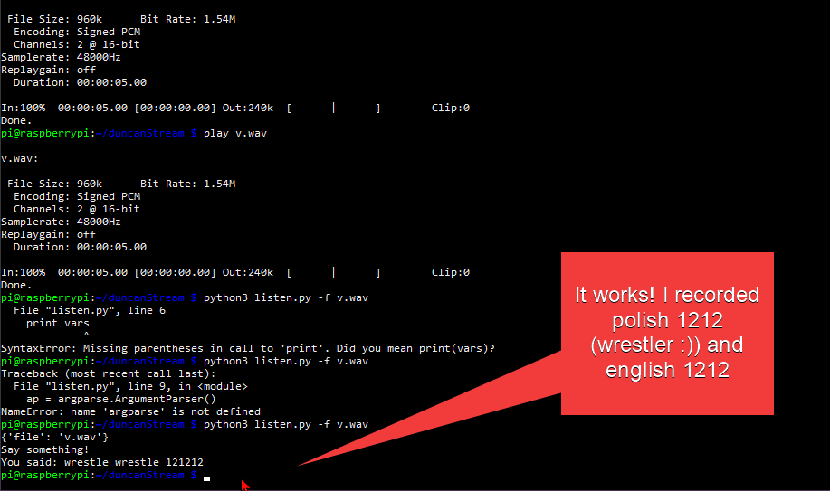
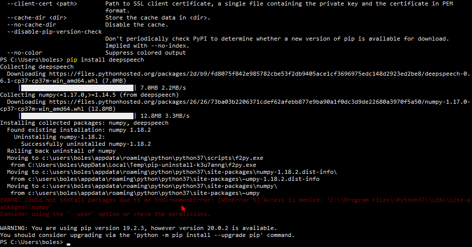
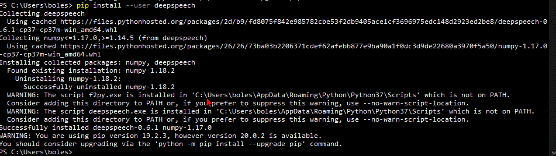
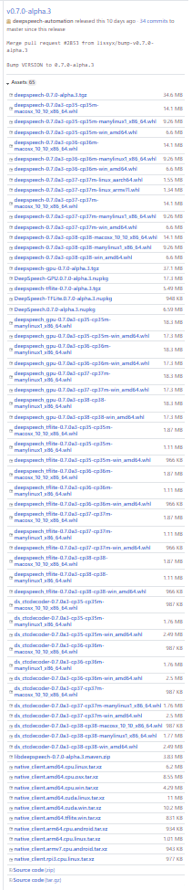

video of working prototype: https://youtu.be/1ie1ujZIjB8

# Contents

[1 Raspberry PI and connecting with Arduino
2](#raspberry-pi-and-connecting-with-arduino)

[1.1 Installing Operating System 2](#installing-operating-system)

[1.2 Identifying usb connected devices
2](#identifying-usb-connected-devices)

[1.3 Face Tracking opencv tutorial 2](#face-tracking-opencv-tutorial)

[1.4 Arduino and Raspberry - Hardware setup – Voltage problems
3](#arduino-and-raspberry---hardware-setup-voltage-problems)

[1.5 Raspberry Pi - Motion – package that turns your RPI into smart
CCTV.
4](#raspberry-pi---motion-package-that-turns-your-rpi-into-smart-cctv.)

[1.6 Raspberry Pi - Face Recognition
4](#raspberry-pi---face-recognition)

[2 SPEECH recognition on raspberry Pi
6](#speech-recognition-on-raspberry-pi)

[2.1 Problems with pseye 4 microphone array
6](#problems-with-pseye-4-microphone-array)

[3 4 april 2020 – breakthrough – and change of direction ?
12](#april-2020-breakthrough-and-change-of-direction)

[3.1 installed picottss by downloading the Debian wheels into raspian
16](#installed-picottss-by-downloading-the-debian-wheels-into-raspian)

[3.2 Adding Interactivity – simple learning algorithm
16](#adding-interactivity-simple-learning-algorithm)

[4 Mozilla DeepSpeech 18](#mozilla-deepspeech)

[**Installation** 18](#_Toc40156222)

[4.1 MozillaDeepSpeech Python – lets try realtime
21](#mozilladeepspeech-python-lets-try-realtime)

[5 Optimising Arduino code 24](#optimising-arduino-code)

[6 Optimising camera behaviour: 25](#optimising-camera-behaviour)

[7 Trust your guts (moustache problem)
26](#trust-your-guts-moustache-problem)

[8 Wazne todo 27](#wazne-todo)

# Raspberry PI and connecting with Arduino

A lot of python tutorials, especially video ones neglect /omit
installation process, importing packages. Because of vast landscape of
platforms and builds, you have to most often do a lot of research prior
to accomplishing the first test run without errors.

## Installing Operating System

29 march 2020

I installed Raspbian on a Raspberry Pi 3B+ Rev 1.3

Please refer to :

<https://www.youtube.com/watch?v=Zhd-i6DKlAU>

or official guides

<https://www.raspberrypi.org/help/noobs-setup/2/>

Traditionally after connecting it to a TV with keyboard and mouse , and
finishing installation , I entered configuration , enabling ssh -
<https://pimylifeup.com/raspberry-pi-ssh/> and interfacing options, as
well as booting to command line. I followed with installing Arduino IDE
on my Windows 10 Laptop. And building a circuit using TinkerCad

Proceeded with searching around Text to speech Synthesis engines

Found this blog entry, massively outdated Still Dan Fountain is the guy
behind Google Text to speech shell I use in the end
<https://web.archive.org/web/20151016182428/http://danfountain.com/2013/03/raspberry-pi-text-to-speech/>

## Identifying usb connected devices

Learned how to display connected devices(?) using dev/tty\*to identify
plugged in devices, this helps to identify

How to address Arduino Serial port using python

Unplug you Arduino , issue ls dev/tty\* plug it in and enter ls
dev/tty\* again to see the port of Arduino.

It will be something in the lines of “dev/ttyUSB0” and depends on other
usb devices connected to your raspberry pi.

Using pyserial

Sudo pip3 install pyserial

## Face Tracking opencv tutorial

Miller, L. (2019) Face Tracking OpenCV, Python, & Arduino. _Learn
Robotics._ 23 May. Av:
<https://www.learnrobotics.org/blog/face-tracking-opencv/amp/> (Acc:

Large portion of my code was inspired by this post/tutorial by Miller
(2019). Unfortunately her code is neither very well commented nor
adapted to extending to any other situation. In Addition you have to
adapt the python 2 syntax to work with python 3 libraries.

## Arduino and Raspberry - Hardware setup – Voltage problems

It is worth remarking that solution proposed is not safe for your
Arduino ( never connect more than one servo to single Arduino board as
power source). If your system will start generating erratic
notifications about plugged in / out USB device it means that there is
not enough power for Arduino due to the burden created by servos.
Arduino cannot supply enough current for servos.

Connecting multiple servos to one source in parallel we allow identical
voltage drop across all servos, but current varies , total current

Voltage drop on the diagram is 6 Volts, however servos drained
batterries quickly. Normal batteries are good for equipment that draws
mA not amps. 5 servos needing 6-7.2 V may put a load on battery.

I repurposed one of many charging usb cables , to replace battery pack
with mobile power bank battery (pic + specs). Till now it seems the most
efficient power source that does not overload servos and provides enough
current to move them all simultaneously.

Figure . Tinkercad electronic circuit diagram.

## Raspberry Pi - Motion – package that turns your RPI into smart CCTV.

Motion is a configurable command-line software turn your raspberry pi
into CCTV hub with http streaming capabilities. There is remote control
interface based on the HTTP request, to manipulate servos. Although
junky, can be utilised if other web interface would be used to integrate
all functionalities into one page application.

<https://www.google.com/url?q=https://motion-project.github.io/&usg=AFQjCNFwrNGzUutNpDnFjD5M3UuEnRqo9w>

Followed this guidance
<https://www.raspberrypi.org/forums/viewtopic.php?t=7397>

However you need to take into account the post is old as well and some
modifications are required

webcam_localhost off

Is now

stream_localhost off

and

control_localhost off

is

webcontrol_localhost off

The program allows multiple cameras and separate configurations for each
. There is a lot of additional configuration – including servo controls,
this is an option if you do not plan complex animations, and probably
just mounted your cameras on servo rigs.

## Raspberry Pi - Face Recognition

Robopathshala (2018) Face Detection+recognition. No date*. Instructable
Circuits*. Av:
<https://www.instructables.com/id/Face-Detectionrecognition/> (Acc:

I followed this simple tutorial by
[Robopathshala(2018)](https://www.instructables.com/id/Face-Detectionrecognition/)
for learning on example how to generate recognition model for faces

Obviously, again certain parts are outdated – it is needed to transform
them for compatibility with opencv version 4

Outdated lines:

recognizer = cv2.createLBPHFaceRecognizer();

\# . . .

font=cv2.cv.InitFont(cv2.cv.CV_FONT_HERSHEY_COMPLEX_SMALL,5,1,0,4)

\# . . .

rec.load("F:/Program Files/projects/face_rec/faceREC/trainingdata.yml")

was changed to:

recognizer = cv2.face.LBPHFaceRecognizer_create()

\# . . .

font = cv2.FONT_HERSHEY_SIMPLEX

\# . . .

rec.read(

load method of the recognizer has been renamed to read in recent
versions of opencv. Please refer to OpenCV documentation
<https://opencv.org/> and try to google search errors thrown by python
interpreter.

and additionally I adapted the sourcecode to work with my streaming
server.

# SPEECH recognition on raspberry Pi

Installing SpeechRecognition requires PyAudio. PyAudio is a dependency
of SpeechRecognition.

Since there is no PyAudio release with support for Windows AMD64 and
python 37 combination I had to browse to
<https://www.lfd.uci.edu/~gohlke/pythonlibs/#pyaudio> to download
unofficial wheel file for pip

I Was afraid that I will need to compile PortAudio C Library, however it
seems that it is included in wheel file, as test script started working
immediately.

Raspberry pi

## Problems with pseye 4 microphone array

Arecord hangs and no sound is recorded

Found this blogpost :
<https://www.cnx-software.com/2019/08/30/using-sony-ps3-eye-camera-as-an-inexpensive-microphone-array/>

Didn’t found /etc/udev/rules.d/70-alsa-permanent.rules

But found /etc/udev/rules.d/99-com.rules

Added files as those that should exist(different Raspbian?) per tutorial

Seems like video settings

I2c gpio rpivid , maybe camera modules?

This is output of alsa identified devices:

pi@raspberrypi:\~/duncanStream \$ arecord -l

\*\*\*\* List of CAPTURE Hardware Devices \*\*\*\*

card 1: CameraB409241 \[USB Camera-B4.09.24.1\], device 0: USB Audio
\[USB Audio\]

Subdevices: 1/1

Installed pulseaudio

Sometimes I think is it not worth to spend so much time trying to set up
one cheap camera PsEye as microphone, since I could buy dedicated
hardware. There is some sense in Adafruit creating dedicated hardware it
helps to avoid this cumbersome process. I feel like I will have to learn
whole linux before setting this to work.

After initial struggle I calmed down , found the
<https://www.raspberrypi.org/forums/viewtopic.php?t=186739> and author
post claims his configuration works.

\# ps3 eye

\#\# Suggested by
http://julius.sourceforge.jp/forum/viewtopic.php?f=9\&t=66

pcm.array {

type hw

card CameraB409241

}

pcm.array_gain {

type softvol

slave {

pcm "array"

}

control {

name "Mic Gain"

count 2

}

min_dB -10.0

max_dB 5.0

}

pcm.cap {

type plug

slave {

pcm "array_gain"

channels 4

}

route_policy sum

}

pcm.\!default {

type asym

playback.pcm {

type plug

slave.pcm {

@func getenv

vars \[ ALSAPCM \]

default "hw:PCH"

}

}

capture.pcm {

type plug

slave.pcm "cap"

}

}

pcm.\!default {

type hw

card 2

}

ctl.\!default {

type hw

card 2

}

This in turn helped me to understand how asoundrc works
<https://www.alsa-project.org/wiki/Asoundrc>

<https://www.raspberrypi.org/forums/viewtopic.php?t=186739> helpful
somewhat

above link considers multiple capture devices but

pcm.array

{

type hw

card CameraB409241

format S16_LE

rate 16000

}

pcm.internal

{

type hw

card 0

}

pcm.array_gain {

type softvol

slave {

pcm "array"

}

control {

name "Mic Gain"

count 2

}

min_dB -10.0

max_dB 5.0

}

pcm.cap {

type plug

slave {

pcm "array_gain"

channels 4

}

route_policy sum

}

pcm.\!default

{

type asym

playback.pcm

{

type plug

slave.pcm "usb"

}

capture.pcm

{

type plug

slave.pcm "cap"

}

}

ctl.\!default

{

type asym

playback.pcm

{

type plug

slave.pcm "usb"

}

capture.pcm

{

type plug

slave.pcm "cap"

}

}

Not sure but it appears that ALSA has problem anyway

Pip install SpeechRecognition

I tried to use speech_recognition module with microphone but pyaudio
has problem interfacing with alsa devices, even if they are working now
on their own (from terminal sudo arecord -D plughw:1 -d 5 -c 4 -r 48000
-f S16_LE t3pore.wav )

So I gave up finally and will attempt to run recording using
subprocess.popen from python and opening the file using
speech_recognition.WavFile().

This may reduce capabilities, constricting the time of the recording but
may work.

# 4 april 2020 – breakthrough – and change of direction ?

Finally I discovered that speech_recognition , or google tts API ,
doesn’t handle 4 channels in current set-up. Therefore I recorded an
audio file with

sudo arecord -D plughw:1 -d 5 -c 2 -r 48000 -f S16_LE v.wav

and modified listen.py program to accept file name as a parameter.

Next step is to incorporate logic from listen.py into my main
duncanStream file, so each time after seeing face he will start
recording.

Prior to following I had to change ownership of the folder , because I
created it as a root and each time I tried to create a file I had to
sudo and python scripts failed due to lack of permissions.

sudo chown -R \$USER /duncanFolder

\-R for recursive \$USER for current user (can be pi in my case)

import subprocess

persons = \["Human", "Bolek", "Maciek", "Ania"\]

greetings =

\["hello.mp3", "bolek.mp3", "maciek.mp3", "ania.mp3"\]

LINUX = True

def hello(id):

global greetings

print("hello" + persons\[id\])

seconds = str(5)

tempfilename = "tmp.wav"

if LINUX:

\# subprocess.run(

\#     \["play", greetings\[id\], "pitch", "500"\])

subprocess.run(

\["play", greetings\[id\], "pitch", "500"\])

subprocess.run(\["arecord", "-D", "plughw:1", "-d", seconds,

"-c", "2", "-r", "48000", "-f", "S16_LE", tempfilename\])

\# sudo arecord  -D plughw:1 -d 5 -c 2 -r 48000 -f S16_LE v.wav

hello(1)

this script successfully runs , creates a file after greeting
interlocutor

Now time for quick dirty test : greet, record tmp.wav file and open it
with subprocess running listen.py script with name of the file as
argument.

TEST.PY:

import subprocess

persons = \["Human", "Bolek", "Maciek", "Ania"\]

greetings = \["hello.mp3", "bolek.mp3", "maciek.mp3", "ania.mp3"\]

LINUX = True

def hear():

print("listening...")

seconds = str(5)

tempfilename = "tmp.wav"

if not LINUX:

input("write something")

subprocess.run(\["arecord", "-D", "plughw:1", "-d", seconds,

"-c", "2", "-r", "48000", "-f", "S16_LE", tempfilename\])

print("recognizing...")

subprocess.run(\["python3", "listen.py", "-f", tempfilename\])

def hello(id):

global greetings

print("hello" + persons\[id\])

seconds = str(5)

tempfilename = "tmp.wav"

if LINUX:

\# subprocess.run(

\#     \["play", greetings\[id\], "pitch", "500"\])

subprocess.run(

\["play", greetings\[id\], "vol", "0.25", "pitch", "500"\])

\# sudo arecord  -D plughw:1 -d 5 -c 2 -r 48000 -f S16_LE v.wav

hear()

hello(1)

LISTEN.PY :

\# Requires PyAudio and PySpeech.

import speech_recognition as sr

import argparse

if \_\_name\_\_ == '\_\_main\_\_':

\# construct the argument parser and parse command line arguments

ap = argparse.ArgumentParser()

ap.add_argument("-f", "--file", type=str, required=True,

help="file to recognize ")

args = vars(ap.parse_args())

print(args)

\# Record Audio

r = sr.Recognizer()

with sr.WavFile(args\['file'\]) as source:

print("Say something\!")

audio = r.record(source)

\# Speech recognition using Google Speech Recognition

try:

\# for testing purposes, we're just using the default API key

\# to use another API key, use \`r.recognize_google(audio, key="GOOGLE_SPEECH_RECOGNITION_API_KEY")\`

\# instead of \`r.recognize_google(audio)\`

print("You said: " + r.recognize_google(audio))

except sr.UnknownValueError:

print("Google Speech Recognition could not understand audio")

except sr.RequestError as e:

print(

"Could not request results from Google Speech Recognition service; {0}".format(e))

pi@raspberrypi:\~/duncanStream \$ python3 test.py

helloBolek

bolek.mp3:

File Size: 5.86k Bit Rate: 32.0k

Encoding: MPEG audio

Channels: 1 @ 16-bit

Samplerate: 24000Hz

Replaygain: off

Duration: 00:00:01.46

In:98.4% 00:00:01.44 \[00:00:00.02\] Out:34.6k \[ | \] Clip:0

Done.

listening...

Recording WAVE 'tmp.wav' : Signed 16 bit Little Endian, Rate 48000 Hz,
Stereo

recognizing...

{'file': 'tmp.wav'}

Say something\!

You said: what is your name

Hurray. Now it’s time to incorporate the logic into main script, so no
separate calls are done. I need to start thinking about writing some
classes and providing modularity to the whole system.

<https://bugs.launchpad.net/raspbian/+bug/1835974>
 

## installed picottss by downloading the Debian wheels into raspian

research over problems with using pico2wav , that seems removed from
Raspbian, because it is not free led me to:

<https://bugs.launchpad.net/raspbian/+bug/1835974>

wget -q <https://ftp-master.debian.org/keys/release-10.asc> -O- |
apt-key add -  
echo "deb <http://deb.debian.org/debian> buster non-free" \>\>
/etc/apt/sources.list  
apt-get update  
apt-get install libttspico0

or without adding the repo:  
wget <http://ftp.us.debian.org/debian/pool/non-free/s/svox/libttspico0_1.0+git20130326-9_armhf.deb>  
wget <http://ftp.us.debian.org/debian/pool/non-free/s/svox/libttspico-utils_1.0+git20130326-9_armhf.deb>  
apt-get install -f ./libttspico0_1.0+git20130326-9_armhf.deb
./libttspico-utils_1.0+git20130326-9_armhf.deb

worked and now I have nice sounding fallback if googtts will start
playing up

additionally I forked snipssuperTTS to cache already produced sounds,
however do not intend going this route yet. The less dependencies on the
network , the better for now.
https://gist.github.com/Osmiogrzesznik/4636fa4ae59d26079c47604561509565

## Adding Interactivity – simple learning algorithm

<https://github.com/howardabrams/cookie-python/blob/master/Animal%20Guessing%20Game.ipynb>

above is good explanation of how the algorithm works

I found animal guessing game

<https://github.com/ninovolador/animal-guesser>

that fits well as old classy ai for kids and some addition to machine
learning

guesser.py

I forked and modified the code so it will use polish language as well,
and to have some base to start from

I reached to the point where I have to make computer recognize my voice.
But’ should I rely on Google STT from Speech_Recognition?

There is issue : if set to pl-PL it does not produce translated output.

Additionally there will be a need for AI to ask for confirmation – did
it understood correctly the spoken word.

To test things on windows I will need to install :

pip install pyttsx3

# Mozilla DeepSpeech

I am interested in Mozilla DeepSpeech project and feel like developing
it in parallel. It may yield better results, and will not require
network, since it is local . Current Speech_recognition uses google API
key reverse-engneered from chrome so it is prone to fail in the future
if Google will revoke it.

First let’s read more :
<https://hacks.mozilla.org/2019/12/deepspeech-0-6-mozillas-speech-to-text-engine/>

API Documentation : <https://deepspeech.readthedocs.io/en/v0.6.1/>

Raspberry Pi4 :
<https://www.seeedstudio.com/blog/2020/01/23/offline-speech-recognition-on-raspberry-pi-4-with-respeaker/comment-page-1/>

Elaine Wu (2020) claims :

**Installation**

**Raspberry Pi 4/3B**

The pre-built wheel package for arm7 architecture is set to use.tflite
model by default and installing it as easy as just

pip3 install deepspeech

Let’s test it out\!

I have run the pip installation command on windows 10 first to keep
similar environments for testing

Obviously :

Figure . windows . need to use --user. Windows oh windows \!

Figure . Interesting - especially these warnings. May result in some
problems later.

It seems that default models are heavy weight. Elain Wu(2020) warns
about the size of the file : 4 GB is a little tough for RPI isn’t it? We
can download the prewview wheel with tflite support

Ooops link on the website doesn’t work,

Let’s go to the source then . Source – code. I mean Github :

<https://github.com/mozilla/DeepSpeech/releases>

There we can see history of latest releases of the package . And my oh
my , does the mozilla approaches the things really well. Builds are done
on all platforms. Just have a look :

Figure . Github deepspeech release builds

So every python version and processor architecture , and os combination
seems to be present here. OpenSource, baby \! (done by people knowing
what they are doing and doing it since looong time)

I downloaded the py37 win amd64 version (whl file for pip)

pip install --user /PROJECT/deepspeech-0.7.0a3-cp37-cp37m-win_amd64.whl

I found identical problem on discourse – unsolved , and proceeded with
adding my comment

pi@raspberrypi:\~/animal-guesser/deepspeech-0.6.1-models \$ deepspeech
--model output_graph.pbmm --audio tds.wav

Loading model from file output_graph.pbmm

TensorFlow: v1.14.0-21-ge77504a

DeepSpeech: v0.6.1-0-g3df20fe

ERROR: Model provided has model identifier '='+;', should be 'TFL3'

Error at reading model file output_graph.pbmm

Traceback (most recent call last):

File "/home/pi/.local/bin/deepspeech", line 10, in \<module\>

sys.exit(main())

File "/home/pi/.local/lib/python3.7/site-packages/deepspeech/client.py",
line 113, in main

ds = Model(args.model, args.beam_width)

File
"/home/pi/.local/lib/python3.7/site-packages/deepspeech/\_\_init\_\_.py",
line 42, in \_\_init\_\_

raise RuntimeError("CreateModel failed with error code
{}".format(status))

RuntimeError: CreateModel failed with error code 12288

By googling “ERROR: Model provided has model identifier '='+;', should
be 'TFL3' RuntimeError: CreateModel failed with error code 12288

I found this issue:

<https://github.com/mozilla/DeepSpeech/issues/2601>

one of the answers Lissyx recommends switching to tflite model, due to
the fact that binaries are pre-configured to use TensorFlow Lite
runtime. Since the error

As documented, RPi3/4 binaries are using the TensorFlow Lite runtime, so
you need to pass output_graph.tflite and not output_graph.pbmm.

deepspeech --model output_graph.tflite --audio myaudio.wav

Loading model from file output_graph.tflite

TensorFlow: v1.14.0-21-ge77504a

DeepSpeech: v0.6.1-0-g3df20fe

INFO: Initialized TensorFlow Lite runtime.

Loaded model in 0.0428s.

Warning: original sample rate (48000) is different than 16000hz.
Resampling might produce erratic speech recognition.

Running inference.

one two one two on to three four five six

Inference took 15.384s for 15.000s audio file.

Weird thing though , using files recorded with 16khz sample rate gives
gibberish output, but contraversely , when warning is displayed while
infering 48000 recording - it gives normal results.

Time to infer is longer when sample rate is as recommended.

## MozillaDeepSpeech Python – lets try realtime

Although I am more comfortable with Javascript I choose to follow
Python, since there is much more resources in connection to Machine
Learning.

No realtime – at least no tutorials, and documentation seems to have
hgigh threshold for python skills

We will go with rec and deepspeech

rec is part of sox (sudo apt install sox)

\$ rec --channels 1 --rate 16k tmp2.wav silence 1 0.01 2% 1 3.0 2%

Mono 16000 sample rate saved to tmp2.wav file with silence effect –
truncates silence (behaves as automatic speech detection, saving only
needed portion of file)

Then we will infer the content with:

deepspeech --model output_graph.tflite --lm lm.binary --trie trie
--audio tmp2.wav

effect is disappointing , the script needs the time to record, then
inference may take up to twice the length of the recording.

<https://www.youtube.com/watch?v=BvAos--wY8s>

I found however some resource:

<https://discourse.mozilla.org/t/real-time-deepspeech-analysis-using-built-in-microphone/42669>

in down below the discussion ( apart from offtopic on difference between
shell and python) I found extended version

next day 6 april 2020 I just wanted to find it be name of the post

<https://github.com/mozilla/DeepSpeech/tree/master/examples/>

deepspeech undergoes so much changes that sometimes it is futile to use
links to point others to content by links.

Examples – this is what we: other people struggling , and I lacked . By
moving examples from repo itself and into separate repository, they
instantly broke typical procedure of installing a package, or repo. It
is in the reademe where you find the links to everywhere, or examples,
and they did not provided any clue in the README to the new location of
examples. This is why so many people struggle to find their first steps
into MDS.

<https://github.com/mozilla/DeepSpeech-examples/tree/r0.6/mic_vad_streaming>

And this comes back to the previous problem – pyAudio needs to be
somehow configured to work with pseye

Microphones array.

<https://stackoverflow.com/questions/4623572/how-do-i-get-a-list-of-my-devices-audio-sample-rates-using-pyaudio-or-portaudio>

For now Lets put the Duncan together

Add subprocess call for animal guessing game

Remember about absolute paths, since processes are executed in the
origin directory.

<https://www.tinkercad.com/things/gqR3O1cl44S-duncan-servo-setup/editel>

TODOS:

Niewyraznie gada

# Optimising Arduino code

Removing the serial output by creating debug function

It stopped working every time when serial debug output was turned off

The main culprit was lack of at least one millisecond delay during loop
execution on arduino. I don’t know why yet but seems rather like some
C++ optimisation thing or serial synchronisation thing. Maybe the case
is characters are written to serial by computer slower and Arduino must
wait a little bit after Serial.available()

# Optimising camera behaviour:

Faces are always min d=65

Face will never be detected on the edge of screen, just before. Need to
take this into account

And 400-65 maximum = 335

Try to implement ROTATE IF DISSAPEARED algorithm

Arduino may treat 65 and 335 as zero and maximum respectively

You can calculate it on Arduino

# Web Interface

## Trust your guts (moustache problem)

Using Jinja2 (in python flask by default) with vue.js creates problem of
clashing “{{}}” symbols

Trust your guts – I though about this problem just at the start , but
handwaved , and somehow few minutes into coding , completely forgot
about it and waste few hours on debugging perfectly working vue.js code

## Remote Control

Following test user advice , it would be more interesting for now for
casual audience to see robot moving steered by their own decisions.
Remot control is simpler, but provides more immediate value. As expected
when I finished users are more interested in steering robot than to
interact with it .

Used sockets

# Wazne todo

Zdalne sterowanie duncanem zrobiloby wiecej wrazenia

T: powiedz slowo
